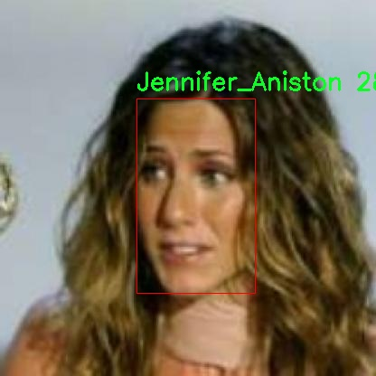

# 外国名人面孔识别检测系统源码分享
 # [一条龙教学YOLOV8标注好的数据集一键训练_70+全套改进创新点发刊_Web前端展示]

### 1.研究背景与意义

项目参考[AAAI Association for the Advancement of Artificial Intelligence](https://gitee.com/qunmasj/projects)

项目来源[AACV Association for the Advancement of Computer Vision](https://kdocs.cn/l/cszuIiCKVNis)

研究背景与意义

在当今信息化和数字化迅速发展的时代，面孔识别技术作为人工智能领域的重要研究方向之一，正逐渐渗透到各个行业和领域。尤其是在社交媒体、安防监控、金融服务和智能家居等应用场景中，面孔识别技术的需求日益增长。随着深度学习技术的进步，尤其是卷积神经网络（CNN）的广泛应用，面孔识别的准确性和效率得到了显著提升。YOLO（You Only Look Once）系列模型因其在实时目标检测中的优越性能而备受关注，其中YOLOv8作为最新版本，进一步优化了检测速度和精度，为面孔识别任务提供了强有力的技术支持。

本研究旨在基于改进的YOLOv8模型，构建一个针对外国名人面孔的识别系统。所使用的数据集包含2000张图像，涵盖60个类别的外国名人，包括政治家、运动员、演员等。这一数据集的多样性和丰富性为面孔识别系统的训练和测试提供了良好的基础。通过对这些名人面孔的识别，不仅可以提升系统的实用性，还能为相关领域的研究提供数据支持。

面孔识别技术的应用潜力巨大。首先，在安防领域，能够快速识别出特定名人，有助于提高公共场所的安全性，防止潜在的安全威胁。其次，在社交媒体和娱乐行业，面孔识别技术可以用于自动标记照片，提升用户体验，增强互动性。此外，在市场营销中，识别名人面孔可以帮助品牌进行精准营销，提升广告投放的效果。因此，基于YOLOv8的外国名人面孔识别系统不仅具有学术研究的价值，也具备广泛的商业应用前景。

然而，现有的面孔识别系统在面对复杂环境、不同光照条件和角度变化时，仍然存在一定的局限性。通过对YOLOv8模型的改进，例如优化网络结构、增强数据集的多样性和丰富性、引入数据增强技术等，可以有效提升系统的鲁棒性和准确性。这一研究不仅能够推动面孔识别技术的发展，还能为后续的研究提供新的思路和方法。

综上所述，基于改进YOLOv8的外国名人面孔识别系统的研究，既是对现有技术的延续和深化，也是对未来应用的探索和实践。通过本研究，期望能够为面孔识别技术的进一步发展贡献力量，同时为相关领域的实际应用提供理论支持和技术保障。

### 2.图片演示


##### 注意：由于此博客编辑较早，上面“2.图片演示”和“3.视频演示”展示的系统图片或者视频可能为老版本，新版本在老版本的基础上升级如下：（实际效果以升级的新版本为准）

  （1）适配了YOLOV8的“目标检测”模型和“实例分割”模型，通过加载相应的权重（.pt）文件即可自适应加载模型。

  （2）支持“图片识别”、“视频识别”、“摄像头实时识别”三种识别模式。

  （3）支持“图片识别”、“视频识别”、“摄像头实时识别”三种识别结果保存导出，解决手动导出（容易卡顿出现爆内存）存在的问题，识别完自动保存结果并导出到tempDir中。

  （4）支持Web前端系统中的标题、背景图等自定义修改，后面提供修改教程。

  另外本项目提供训练的数据集和训练教程,暂不提供权重文件（best.pt）,需要您按照教程进行训练后实现图片演示和Web前端界面演示的效果。

### 3.视频演示

[3.1 视频演示](https://www.bilibili.com/video/BV17LsZeLEg7/)

### 4.数据集信息展示

##### 4.1 本项目数据集详细数据（类别数＆类别名）

nc: 58
names: ['Alejandro_Toledo', 'Alvaro_Uribe', 'Amelie_Mauresmo', 'Andre_Agassi', 'Angelina_Jolie', 'Ariel_Sharon', 'Arnold_Schwarzenegger', 'Atal_Bihari_Vajpayee', 'Bill_Clinton', 'Carlos_Menem', 'David_Beckham', 'George_Robertson', 'Gloria_Macapagal_Arroyo', 'Gray_Davis', 'Guillermo_Coria', 'Hamid_Karzai', 'Hans_Blix', 'Hugo_Chavez', 'Igor_Ivanov', 'Jack_Straw', 'Jacques_Chirac', 'Jean_Chretien', 'Jennifer_Aniston', 'Jennifer_Capriati', 'Jennifer_Lopez', 'Jeremy_Greenstock', 'Jiang_Zemin', 'John_Ashcroft', 'John_Negroponte', 'Jose_Maria_Aznar', 'Juan_Carlos_Ferrero', 'Junichiro_Koizumi', 'Kofi_Annan', 'Laura_Bush', 'Lindsay_Davenport', 'Lleyton_Hewitt', 'Luiz_Inacio_Lula_da_Silva', 'Mahmoud_Abbas', 'Megawati_Sukarnoputri', 'Michael_Bloomberg', 'Naomi_Watts', 'Nestor_Kirchner', 'Paul_Bremer', 'Pete_Sampras', 'Recep_Tayyip_Erdogan', 'Ricardo_Lagos', 'Roh_Moo-hyun', 'Ronald', 'Rudolph_Giuliani', 'Saddam_Hussein', 'Serena_Williams', 'Silvio_Berlusconi', 'Tiger_Woods', 'Tom_Daschle', 'Tom_Ridge', 'Vicente_Fox', 'Vladimir_Putin', 'Winona_Ryder']


##### 4.2 本项目数据集信息介绍

数据集信息展示

在本研究中，我们使用了名为“all+me”的数据集，以训练和改进YOLOv8模型，旨在实现对外国名人面孔的高效识别。该数据集包含58个类别，涵盖了众多知名人士，提供了丰富的面孔图像，适合用于面部识别任务。每个类别代表一位外国名人，数据集中的类别名称包括政治家、运动员、演员和其他公众人物，反映了多样化的社会文化背景。

具体而言，数据集中包含的类别有：Alejandro Toledo、Alvaro Uribe、Amelie Mauresmo、Andre Agassi、Angelina Jolie、Ariel Sharon、Arnold Schwarzenegger、Atal Bihari Vajpayee、Bill Clinton、Carlos Menem、David Beckham、George Robertson、Gloria Macapagal Arroyo、Gray Davis、Guillermo Coria、Hamid Karzai、Hans Blix、Hugo Chavez、Igor Ivanov、Jack Straw、Jacques Chirac、Jean Chretien、Jennifer Aniston、Jennifer Capriati、Jennifer Lopez、Jeremy Greenstock、Jiang Zemin、John Ashcroft、John Negroponte、Jose Maria Aznar、Juan Carlos Ferrero、Junichiro Koizumi、Kofi Annan、Laura Bush、Lindsay Davenport、Lleyton Hewitt、Luiz Inacio Lula da Silva、Mahmoud Abbas、Megawati Sukarnoputri、Michael Bloomberg、Naomi Watts、Nestor Kirchner、Paul Bremer、Pete Sampras、Recep Tayyip Erdogan、Ricardo Lagos、Roh Moo-hyun、Ronald、Rudolph Giuliani、Saddam Hussein、Serena Williams、Silvio Berlusconi、Tiger Woods、Tom Daschle、Tom Ridge、Vicente Fox、Vladimir Putin和Winona Ryder。

该数据集的设计考虑到了面部识别技术的多样性和复杂性。每个类别的图像数量和质量均经过精心挑选，以确保模型能够学习到每位名人的独特面部特征。数据集中不仅包含了不同角度、不同光照条件下的面孔图像，还涵盖了各种表情和妆容变化，增强了模型的泛化能力。

在训练过程中，YOLOv8模型将通过这些多样化的图像数据进行特征提取和学习，以提高其在实际应用中的准确性和鲁棒性。面部识别技术在许多领域中都有广泛的应用，包括安全监控、社交媒体分析、用户身份验证等，因此构建一个高效的名人面孔识别系统具有重要的现实意义。

此外，数据集的多样性也为后续的研究提供了丰富的基础。通过对“all+me”数据集的深入分析，我们可以探讨不同名人面孔在识别过程中的表现差异，进一步优化YOLOv8模型的参数设置和训练策略，以达到更高的识别率和更低的误识率。

综上所述，“all+me”数据集不仅为YOLOv8模型的训练提供了坚实的基础，也为面部识别技术的研究与应用开辟了新的方向。通过对这一数据集的充分利用，我们期望能够推动外国名人面孔识别系统的进步，为相关领域的研究者和开发者提供有价值的参考和支持。





### 5.全套项目环境部署视频教程（零基础手把手教学）

[5.1 环境部署教程链接（零基础手把手教学）](https://www.ixigua.com/7404473917358506534?logTag=c807d0cbc21c0ef59de5)


[5.2 安装Python虚拟环境创建和依赖库安装视频教程链接（零基础手把手教学）](https://www.ixigua.com/7404474678003106304?logTag=1f1041108cd1f708b01a)

### 6.手把手YOLOV8训练视频教程（零基础小白有手就能学会）

[6.1 手把手YOLOV8训练视频教程（零基础小白有手就能学会）](https://www.ixigua.com/7404477157818401292?logTag=d31a2dfd1983c9668658)

### 7.70+种全套YOLOV8创新点代码加载调参视频教程（一键加载写好的改进模型的配置文件）

[7.1 70+种全套YOLOV8创新点代码加载调参视频教程（一键加载写好的改进模型的配置文件）](https://www.ixigua.com/7404478314661806627?logTag=29066f8288e3f4eea3a4)

### 8.70+种全套YOLOV8创新点原理讲解（非科班也可以轻松写刊发刊，V10版本正在科研待更新）

由于篇幅限制，每个创新点的具体原理讲解就不一一展开，具体见下列网址中的创新点对应子项目的技术原理博客网址【Blog】：


[8.1 70+种全套YOLOV8创新点原理讲解链接](https://gitee.com/qunmasj/good)

### 9.系统功能展示（检测对象为举例，实际内容以本项目数据集为准）

图9.1.系统支持检测结果表格显示

  图9.2.系统支持置信度和IOU阈值手动调节

  图9.3.系统支持自定义加载权重文件best.pt(需要你通过步骤5中训练获得)

  图9.4.系统支持摄像头实时识别

  图9.5.系统支持图片识别

  图9.6.系统支持视频识别

  图9.7.系统支持识别结果文件自动保存

  图9.8.系统支持Excel导出检测结果数据


### 10.原始YOLOV8算法原理

原始YOLOv8算法原理

YOLOv8算法是目标检测领域的一个重要进展，由Glenn Jocher提出，延续了YOLO系列模型的设计理念，特别是YOLOv3和YOLOv5的核心思想。YOLOv8在原有模型的基础上进行了多项创新和改进，旨在提升目标检测的精度和速度。其架构由三个主要部分组成：Backbone、Neck和Head，每个部分在整体网络性能中都扮演着至关重要的角色。

在Backbone部分，YOLOv8采用了一系列卷积和反卷积层，以提取输入图像的特征。与前代模型相比，YOLOv8引入了C2模块作为基本构成单元，显著增强了特征提取的能力。C2模块通过引入更多的分支，允许网络在梯度回传时拥有更丰富的信息流，从而提升了模型的学习能力。Backbone部分由多个CBS模块、C2f模块和一个快速空间金字塔池化（SPPF）模块组成，这种设计使得YOLOv8能够在不同尺度上有效提取特征，尤其是在处理复杂场景时，能够更好地捕捉到目标的细节。

Neck部分则负责多尺度特征的融合。YOLOv8通过采用特征金字塔网络（FPN）和路径聚合网络（PAN）的组合，确保来自Backbone不同阶段的特征图能够有效地融合在一起。这种融合技术不仅提升了模型对不同尺度目标的检测能力，还增强了其鲁棒性，使得YOLOv8在面对多样化的目标时，依然能够保持较高的检测精度。通过这种多尺度特征融合，YOLOv8能够在复杂背景中更准确地定位目标，极大地提高了目标检测的效果。

在Head部分，YOLOv8负责最终的目标检测和分类任务。其设计采用了解耦头结构，将分类和定位任务分开处理，分别通过两条并行的分支进行特征提取。这样的设计不仅提高了检测的准确性，还减少了模型的复杂性。检测头内部包含多个卷积层和反卷积层，负责将经过Neck处理后的特征图转换为最终的检测结果。这种解耦结构使得YOLOv8在处理不同类别的目标时，能够更加灵活地调整其分类和定位策略，从而提升整体性能。

YOLOv8在数据预处理方面也延续了YOLOv5的策略，采用了多种数据增强技术，包括马赛克增强、混合增强、空间扰动和颜色扰动等。这些增强手段不仅丰富了训练数据的多样性，还有效提升了模型的泛化能力，使得YOLOv8在面对不同环境和条件下的目标检测任务时，能够表现得更加出色。

值得一提的是，YOLOv8在标签分配策略上进行了创新，采用了动态标签分配策略，解决了正负样本匹配的问题。与YOLOv5依赖于聚类候选框的策略不同，YOLOv8通过TOOD策略动态分配标签，使得模型在训练过程中能够更有效地学习到目标的特征。YOLOv8的损失函数设计也相应进行了优化，分类损失采用了Varifocal Loss，而回归损失则结合了CIoU Loss和DFL Loss。这种损失函数的设计使得模型在训练时能够更关注高质量的正样本，同时降低负样本对整体损失的影响，从而提升了检测精度。

总的来说，YOLOv8算法通过对Backbone、Neck和Head的精心设计，以及在数据预处理和标签分配策略上的创新，显著提升了目标检测的性能。其高效的特征提取和目标检测方式，使得YOLOv8在实际应用中展现出更高的准确度和更快的检测速度，成为目标检测领域的重要工具。随着YOLOv8的推出，目标检测技术又向前迈进了一大步，为各类应用场景提供了更为强大的支持。


### 11.项目核心源码讲解（再也不用担心看不懂代码逻辑）

#### 11.1 ui.py

以下是经过精简和注释的核心代码：

```python
import sys
import subprocess
from QtFusion.path import abs_path

def run_script(script_path):
    """
    使用当前 Python 环境运行指定的脚本。

    Args:
        script_path (str): 要运行的脚本路径
    """
    # 获取当前 Python 解释器的路径
    python_path = sys.executable

    # 构建运行命令，使用 streamlit 运行指定的脚本
    command = f'"{python_path}" -m streamlit run "{script_path}"'

    # 执行命令并捕获结果
    result = subprocess.run(command, shell=True)
    
    # 检查脚本运行是否成功
    if result.returncode != 0:
        print("脚本运行出错。")

# 主程序入口
if __name__ == "__main__":
    # 获取脚本的绝对路径
    script_path = abs_path("web.py")

    # 运行指定的脚本
    run_script(script_path)
```

### 代码注释说明：
1. **导入模块**：
   - `sys`：用于访问与 Python 解释器紧密相关的变量和函数。
   - `subprocess`：用于执行外部命令。
   - `abs_path`：从 `QtFusion.path` 模块导入的函数，用于获取文件的绝对路径。

2. **`run_script` 函数**：
   - 功能：接收一个脚本路径并在当前 Python 环境中运行该脚本。
   - 参数：`script_path` 是要运行的脚本的路径。
   - 使用 `sys.executable` 获取当前 Python 解释器的路径，以确保使用正确的 Python 环境。
   - 构建命令字符串，使用 `streamlit` 运行指定的脚本。
   - 使用 `subprocess.run` 执行命令，并检查返回代码以确定脚本是否成功运行。

3. **主程序入口**：
   - 检查 `__name__` 是否为 `"__main__"`，以确保只有在直接运行该脚本时才执行以下代码。
   - 使用 `abs_path` 获取 `web.py` 的绝对路径。
   - 调用 `run_script` 函数来运行指定的脚本。

这个程序文件 `ui.py` 的主要功能是通过当前的 Python 环境来运行一个指定的脚本，具体是使用 Streamlit 来启动一个 Web 应用。程序首先导入了必要的模块，包括 `sys`、`os` 和 `subprocess`，以及一个自定义的路径处理函数 `abs_path`。

在 `run_script` 函数中，首先获取当前 Python 解释器的路径，这样可以确保使用正确的 Python 环境来执行脚本。接着，构建一个命令字符串，该命令使用 Streamlit 来运行指定的脚本。命令的格式是 `python -m streamlit run script_path`，其中 `script_path` 是要运行的脚本的路径。

然后，使用 `subprocess.run` 来执行这个命令。这个函数会在一个新的子进程中运行命令，并等待其完成。如果命令执行的返回码不为零，表示脚本运行过程中出现了错误，程序会打印出相应的错误信息。

在文件的最后部分，使用 `if __name__ == "__main__":` 来确保当这个文件作为主程序运行时，才会执行下面的代码。这里指定了要运行的脚本路径 `web.py`，并调用 `run_script` 函数来启动这个脚本。

总体来说，这个文件的功能是提供一个简单的接口，通过命令行来启动一个 Streamlit Web 应用，便于开发和测试。

#### 11.2 70+种YOLOv8算法改进源码大全和调试加载训练教程（非必要）\ultralytics\nn\backbone\EfficientFormerV2.py

以下是简化后的核心代码部分，并附有详细的中文注释：

```python
import torch
import torch.nn as nn
import math
import itertools

class Attention4D(nn.Module):
    """实现4D注意力机制的类"""
    def __init__(self, dim=384, key_dim=32, num_heads=8, attn_ratio=4, resolution=7):
        super().__init__()
        self.num_heads = num_heads  # 注意力头的数量
        self.scale = key_dim ** -0.5  # 缩放因子
        self.key_dim = key_dim  # 键的维度
        self.d = int(attn_ratio * key_dim)  # 注意力输出的维度

        # 初始化查询、键、值的卷积层
        self.q = nn.Conv2d(dim, num_heads * key_dim, kernel_size=1)
        self.k = nn.Conv2d(dim, num_heads * key_dim, kernel_size=1)
        self.v = nn.Conv2d(dim, num_heads * self.d, kernel_size=1)

        # 注意力偏置
        self.attention_biases = nn.Parameter(torch.zeros(num_heads, resolution ** 2))

    def forward(self, x):
        """前向传播函数"""
        B, C, H, W = x.shape  # 获取输入的形状
        q = self.q(x).view(B, self.num_heads, -1, H * W).permute(0, 1, 3, 2)  # 计算查询
        k = self.k(x).view(B, self.num_heads, -1, H * W)  # 计算键
        v = self.v(x).view(B, self.num_heads, -1, H * W)  # 计算值

        # 计算注意力分数
        attn = (q @ k) * self.scale + self.attention_biases
        attn = attn.softmax(dim=-1)  # 归一化

        # 计算输出
        x = (attn @ v).permute(0, 1, 3, 2).view(B, self.d, H, W)
        return x

class Mlp(nn.Module):
    """实现多层感知机的类"""
    def __init__(self, in_features, hidden_features=None, out_features=None):
        super().__init__()
        hidden_features = hidden_features or in_features
        self.fc1 = nn.Conv2d(in_features, hidden_features, kernel_size=1)  # 第一层卷积
        self.fc2 = nn.Conv2d(hidden_features, out_features or in_features, kernel_size=1)  # 第二层卷积

    def forward(self, x):
        """前向传播函数"""
        x = self.fc1(x)
        x = torch.relu(x)  # 激活函数
        x = self.fc2(x)
        return x

class EfficientFormerV2(nn.Module):
    """EfficientFormerV2模型的实现"""
    def __init__(self, layers, embed_dims):
        super().__init__()
        self.network = nn.ModuleList()  # 存储网络的各个层

        # 构建网络
        for i in range(len(layers)):
            self.network.append(Attention4D(dim=embed_dims[i]))  # 添加注意力层
            self.network.append(Mlp(in_features=embed_dims[i], hidden_features=embed_dims[i] * 4))  # 添加MLP层

    def forward(self, x):
        """前向传播函数"""
        for block in self.network:
            x = block(x)  # 依次通过每个层
        return x

# 示例代码：创建模型并进行前向传播
if __name__ == '__main__':
    inputs = torch.randn((1, 3, 640, 640))  # 输入张量
    model = EfficientFormerV2(layers=[2, 2], embed_dims=[32, 64])  # 创建模型
    res = model(inputs)  # 前向传播
    print(res.size())  # 输出结果的形状
```

### 代码注释说明：
1. **Attention4D类**：实现了一个4D注意力机制，主要包括查询、键、值的计算和注意力分数的归一化。
2. **Mlp类**：实现了一个简单的多层感知机，包含两层卷积和ReLU激活函数。
3. **EfficientFormerV2类**：构建了一个EfficientFormerV2模型，由多个注意力层和MLP层组成。
4. **主程序**：创建一个输入张量并通过模型进行前向传播，最后输出结果的形状。

这个程序文件实现了一个名为 `EfficientFormerV2` 的深度学习模型，主要用于图像处理任务，尤其是在计算机视觉领域。该模型是基于高效的 Transformer 架构，旨在提高计算效率和模型性能。

首先，文件中定义了一些模型的超参数，包括不同规模的模型（如 S0、S1、S2 和 L）的宽度和深度。这些参数用于控制模型的复杂性和计算需求。例如，`EfficientFormer_width` 和 `EfficientFormer_depth` 字典分别定义了不同规模模型的通道数和层数。

接下来，定义了多个类，其中 `Attention4D` 类实现了一个四维注意力机制，用于捕捉图像特征之间的关系。这个类的构造函数中包含多个卷积层和归一化层，能够对输入的特征图进行处理，生成注意力权重，并通过加权求和得到输出特征。

`LGQuery` 类用于生成局部查询特征，结合了平均池化和卷积操作，以增强模型对局部特征的提取能力。

`Attention4DDownsample` 类实现了带有下采样的注意力机制，适用于特征图尺寸减小的情况。这个类的设计考虑了不同分辨率下的特征处理，确保在下采样过程中保持信息的完整性。

`Embedding` 类用于将输入图像嵌入到一个更高维的特征空间中，支持不同的嵌入方式（如轻量级嵌入和带注意力的嵌入）。

`Mlp` 类实现了一个多层感知机（MLP），使用 1x1 卷积来处理特征，具有可选的中间卷积层和 Dropout 层，以提高模型的表达能力和防止过拟合。

`AttnFFN` 和 `FFN` 类分别实现了带有注意力机制的前馈网络和普通前馈网络，前者结合了注意力和 MLP，后者则仅使用 MLP。

`eformer_block` 函数用于构建模型的各个块，结合了不同的网络层，形成完整的网络结构。

`EfficientFormerV2` 类是模型的核心部分，负责将所有组件组合在一起。它的构造函数中根据传入的参数构建网络，并支持特征的分叉输出。模型的前向传播方法 `forward` 将输入数据通过各个网络层进行处理，并返回特征输出。

最后，文件中定义了一些函数（如 `efficientformerv2_s0`、`efficientformerv2_s1` 等）用于创建不同规模的 EfficientFormerV2 模型，并加载预训练权重。

在 `__main__` 部分，程序创建了不同规模的模型实例，并使用随机生成的输入数据进行测试，输出每个模型的特征图尺寸。这部分代码展示了如何使用该模型进行推理。

总体而言，这个文件实现了一个灵活且高效的图像处理模型，适用于各种计算机视觉任务，具有良好的可扩展性和性能。

#### 11.3 code\ultralytics\solutions\object_counter.py

以下是经过简化并添加详细中文注释的核心代码部分：

```python
from collections import defaultdict
import cv2
from shapely.geometry import LineString, Point, Polygon

class ObjectCounter:
    """管理实时视频流中对象计数的类。"""

    def __init__(self):
        """初始化计数器，设置默认参数。"""
        # 鼠标事件相关
        self.is_drawing = False  # 是否正在绘制
        self.selected_point = None  # 选中的点

        # 区域和线的信息
        self.reg_pts = [(20, 400), (1260, 400)]  # 默认计数区域的点
        self.line_dist_thresh = 15  # 线计数的距离阈值
        self.counting_region = None  # 计数区域
        self.region_color = (255, 0, 255)  # 区域颜色
        self.region_thickness = 5  # 区域线条厚度

        # 图像和注释信息
        self.im0 = None  # 当前帧图像
        self.view_img = False  # 是否显示图像
        self.view_in_counts = True  # 是否显示进入计数
        self.view_out_counts = True  # 是否显示离开计数

        # 计数信息
        self.in_counts = 0  # 进入计数
        self.out_counts = 0  # 离开计数
        self.counting_list = []  # 计数列表
        self.track_history = defaultdict(list)  # 跟踪历史记录

    def set_args(self, classes_names, reg_pts):
        """
        配置计数器的参数，包括类名和计数区域点。

        Args:
            classes_names (dict): 类别名称
            reg_pts (list): 定义计数区域的点
        """
        # 设置计数区域
        if len(reg_pts) == 2:
            self.reg_pts = reg_pts
            self.counting_region = LineString(self.reg_pts)  # 线计数
        elif len(reg_pts) == 4:
            self.reg_pts = reg_pts
            self.counting_region = Polygon(self.reg_pts)  # 区域计数
        else:
            print("提供的区域点无效，区域点可以是2或4")
            self.counting_region = LineString(self.reg_pts)  # 默认使用线计数

        self.names = classes_names  # 设置类别名称

    def extract_and_process_tracks(self, tracks):
        """提取并处理视频流中的跟踪信息以进行对象计数。"""
        boxes = tracks[0].boxes.xyxy.cpu()  # 获取边界框
        clss = tracks[0].boxes.cls.cpu().tolist()  # 获取类别
        track_ids = tracks[0].boxes.id.int().cpu().tolist()  # 获取跟踪ID

        # 遍历每个检测到的对象
        for box, track_id, cls in zip(boxes, track_ids, clss):
            # 计算对象的中心点
            track_line = self.track_history[track_id]
            track_line.append((float((box[0] + box[2]) / 2), float((box[1] + box[3]) / 2)))
            if len(track_line) > 30:
                track_line.pop(0)  # 限制历史记录长度

            # 计数逻辑
            prev_position = self.track_history[track_id][-2] if len(self.track_history[track_id]) > 1 else None
            if prev_position is not None:
                if self.counting_region.contains(Point(track_line[-1])) and track_id not in self.counting_list:
                    self.counting_list.append(track_id)  # 添加到计数列表
                    # 判断是进入还是离开
                    if (box[0] - prev_position[0]) * (self.counting_region.centroid.x - prev_position[0]) > 0:
                        self.in_counts += 1  # 进入计数
                    else:
                        self.out_counts += 1  # 离开计数

    def start_counting(self, im0, tracks):
        """
        启动对象计数过程。

        Args:
            im0 (ndarray): 当前视频帧。
            tracks (list): 从对象跟踪过程中获得的跟踪列表。
        """
        self.im0 = im0  # 存储当前帧图像
        if tracks[0].boxes.id is None:
            return  # 如果没有检测到对象，直接返回
        self.extract_and_process_tracks(tracks)  # 提取和处理跟踪信息
        return self.im0  # 返回处理后的图像

if __name__ == "__main__":
    ObjectCounter()  # 创建对象计数器实例
```

### 代码说明：
1. **类的初始化**：`__init__` 方法设置了对象计数器的初始状态，包括鼠标事件、计数区域、计数信息等。
2. **设置参数**：`set_args` 方法用于配置计数器的参数，如类别名称和计数区域的点。
3. **提取和处理跟踪信息**：`extract_and_process_tracks` 方法从跟踪数据中提取信息，并进行计数。
4. **启动计数过程**：`start_counting` 方法是主函数，负责启动计数过程并处理每一帧图像。

这个程序文件定义了一个名为 `ObjectCounter` 的类，用于在实时视频流中基于物体的轨迹进行计数。该类的主要功能是通过用户定义的区域来跟踪和计数物体的进出情况。

在初始化方法 `__init__` 中，类设置了一些默认值，包括鼠标事件的状态、计数区域的点、计数阈值、图像显示的标志、计数信息、轨迹信息等。计数区域可以是线或多边形，具体取决于用户提供的点的数量。

`set_args` 方法用于配置计数器的参数，包括类名、计数区域的点、线条和区域的颜色、厚度等。用户可以通过这个方法自定义计数器的行为和外观。

`mouse_event_for_region` 方法处理鼠标事件，允许用户通过鼠标拖动来调整计数区域的形状。它会根据鼠标的移动更新计数区域的点。

`extract_and_process_tracks` 方法从跟踪数据中提取信息，并进行物体计数。它会绘制边界框和轨迹，并根据物体的位置判断其是进入还是离开计数区域。计数的结果会被更新并在图像上显示。

`display_frames` 方法用于显示当前帧图像，并在窗口中设置鼠标回调，以便用户可以交互式地调整计数区域。

`start_counting` 方法是该类的主要入口，负责处理每一帧图像和对应的跟踪数据。它会调用其他方法来提取和处理轨迹，并在需要时显示图像。

最后，在文件的主程序部分，创建了 `ObjectCounter` 的实例，虽然没有进一步的操作，但这表明该类可以被用作一个独立的对象计数工具。整个程序结合了计算机视觉和用户交互，能够实时监控和计数视频流中的物体。

#### 11.4 code\ultralytics\data\explorer\__init__.py

以下是代码中最核心的部分，并附上详细的中文注释：

```python
# 导入Ultralytics YOLO库中的plot_query_result函数
from .utils import plot_query_result

# 定义模块的公开接口，只有plot_query_result函数可以被外部访问
__all__ = ["plot_query_result"]
```

### 注释说明：
1. `from .utils import plot_query_result`：这一行代码从当前模块的utils子模块中导入了`plot_query_result`函数。这个函数可能用于绘制查询结果，具体功能依赖于utils模块的实现。

2. `__all__ = ["plot_query_result"]`：这一行代码定义了模块的公开接口。通过设置`__all__`，我们指定了当使用`from module import *`语句时，只有`plot_query_result`函数会被导入。这是一种控制模块可见性的方式，确保只有特定的功能可以被外部使用。

这个程序文件是一个Python模块，属于Ultralytics YOLO项目的一部分，使用AGPL-3.0许可证。文件的主要功能是导入并公开一个名为`plot_query_result`的函数或类，这个函数或类位于同一目录下的`utils`模块中。

在文件的开头，有一个注释行，简单介绍了这个项目的名称（Ultralytics YOLO）和其许可证类型。接下来，使用`from .utils import plot_query_result`语句，从当前包的`utils`模块中导入`plot_query_result`。这个语句的前面有一个点（`.`），表示这是一个相对导入，意味着`utils`模块与当前模块在同一目录下。

最后，`__all__`是一个特殊的变量，用于定义当使用`from module import *`语句时，哪些名称会被导入。在这里，`__all__`被设置为包含`plot_query_result`，这意味着如果其他模块使用通配符导入这个模块时，只会导入`plot_query_result`这个名称。

总的来说，这个文件的作用是将`plot_query_result`函数或类暴露给其他模块，以便在Ultralytics YOLO项目中使用。

#### 11.5 train.py

以下是代码中最核心的部分，并附上详细的中文注释：

```python
class DetectionTrainer(BaseTrainer):
    """
    DetectionTrainer类扩展了BaseTrainer类，用于基于检测模型的训练。
    """

    def build_dataset(self, img_path, mode="train", batch=None):
        """
        构建YOLO数据集。

        参数:
            img_path (str): 包含图像的文件夹路径。
            mode (str): 模式，可以是'train'或'val'，用户可以为每种模式自定义不同的增强。
            batch (int, optional): 批次大小，仅适用于'rect'模式。默认为None。
        """
        gs = max(int(de_parallel(self.model).stride.max() if self.model else 0), 32)
        return build_yolo_dataset(self.args, img_path, batch, self.data, mode=mode, rect=mode == "val", stride=gs)

    def get_dataloader(self, dataset_path, batch_size=16, rank=0, mode="train"):
        """构造并返回数据加载器。"""
        assert mode in ["train", "val"]  # 确保模式是'train'或'val'
        with torch_distributed_zero_first(rank):  # 在分布式环境中，确保数据集只初始化一次
            dataset = self.build_dataset(dataset_path, mode, batch_size)
        shuffle = mode == "train"  # 训练模式下打乱数据
        if getattr(dataset, "rect", False) and shuffle:
            LOGGER.warning("WARNING ⚠️ 'rect=True'与DataLoader的shuffle不兼容，设置shuffle=False")
            shuffle = False
        workers = self.args.workers if mode == "train" else self.args.workers * 2  # 根据模式设置工作线程数
        return build_dataloader(dataset, batch_size, workers, shuffle, rank)  # 返回数据加载器

    def preprocess_batch(self, batch):
        """对一批图像进行预处理，包括缩放和转换为浮点数。"""
        batch["img"] = batch["img"].to(self.device, non_blocking=True).float() / 255  # 将图像转移到设备并归一化
        if self.args.multi_scale:  # 如果启用多尺度
            imgs = batch["img"]
            sz = (
                random.randrange(self.args.imgsz * 0.5, self.args.imgsz * 1.5 + self.stride)
                // self.stride
                * self.stride
            )  # 随机选择一个尺寸
            sf = sz / max(imgs.shape[2:])  # 计算缩放因子
            if sf != 1:  # 如果缩放因子不为1
                ns = [
                    math.ceil(x * sf / self.stride) * self.stride for x in imgs.shape[2:]
                ]  # 计算新的形状
                imgs = nn.functional.interpolate(imgs, size=ns, mode="bilinear", align_corners=False)  # 进行插值缩放
            batch["img"] = imgs  # 更新批次中的图像
        return batch

    def get_model(self, cfg=None, weights=None, verbose=True):
        """返回一个YOLO检测模型。"""
        model = DetectionModel(cfg, nc=self.data["nc"], verbose=verbose and RANK == -1)  # 创建检测模型
        if weights:
            model.load(weights)  # 如果提供了权重，则加载权重
        return model

    def get_validator(self):
        """返回用于YOLO模型验证的DetectionValidator。"""
        self.loss_names = "box_loss", "cls_loss", "dfl_loss"  # 定义损失名称
        return yolo.detect.DetectionValidator(
            self.test_loader, save_dir=self.save_dir, args=copy(self.args), _callbacks=self.callbacks
        )  # 返回验证器

    def plot_training_samples(self, batch, ni):
        """绘制带有注释的训练样本。"""
        plot_images(
            images=batch["img"],
            batch_idx=batch["batch_idx"],
            cls=batch["cls"].squeeze(-1),
            bboxes=batch["bboxes"],
            paths=batch["im_file"],
            fname=self.save_dir / f"train_batch{ni}.jpg",
            on_plot=self.on_plot,
        )  # 绘制图像并保存

    def plot_metrics(self):
        """从CSV文件中绘制指标。"""
        plot_results(file=self.csv, on_plot=self.on_plot)  # 保存结果图像
```

### 代码核心部分说明：
1. **DetectionTrainer类**：继承自BaseTrainer，专门用于YOLO模型的训练。
2. **build_dataset方法**：构建YOLO数据集，支持训练和验证模式。
3. **get_dataloader方法**：构造数据加载器，处理数据的打乱和工作线程数。
4. **preprocess_batch方法**：对图像批次进行预处理，包括归一化和缩放。
5. **get_model方法**：返回YOLO检测模型，并可加载预训练权重。
6. **get_validator方法**：返回用于模型验证的验证器。
7. **plot_training_samples和plot_metrics方法**：用于可视化训练样本和绘制训练指标。

这个程序文件 `train.py` 是一个用于训练 YOLO（You Only Look Once）目标检测模型的实现，基于 Ultralytics 的 YOLO 框架。文件中定义了一个名为 `DetectionTrainer` 的类，继承自 `BaseTrainer`，专门用于处理目标检测任务。

在类的构造中，首先提供了一个示例，展示如何使用 `DetectionTrainer` 类进行模型训练。用户可以通过传入模型配置、数据集配置和训练轮数等参数来初始化训练器并开始训练。

`DetectionTrainer` 类中包含多个方法，主要功能如下：

- `build_dataset` 方法用于构建 YOLO 数据集，接受图像路径、模式（训练或验证）和批次大小作为参数。该方法根据模型的步幅设置，调用 `build_yolo_dataset` 函数来创建数据集。

- `get_dataloader` 方法用于构建数据加载器，确保在分布式训练时只初始化一次数据集。它根据训练或验证模式设置是否打乱数据，并调用 `build_dataloader` 返回数据加载器。

- `preprocess_batch` 方法负责对输入的图像批次进行预处理，包括缩放和转换为浮点数格式。该方法还支持多尺度训练，通过随机选择图像大小来增强模型的鲁棒性。

- `set_model_attributes` 方法用于设置模型的属性，包括类别数量和类别名称，以便模型能够正确处理数据集中的目标。

- `get_model` 方法返回一个 YOLO 检测模型的实例，并可以加载预训练权重。

- `get_validator` 方法返回一个用于验证 YOLO 模型的验证器，设置损失名称以便后续记录和分析。

- `label_loss_items` 方法返回一个包含训练损失项的字典，便于跟踪训练过程中的损失变化。

- `progress_string` 方法返回一个格式化的字符串，显示训练进度，包括当前轮次、GPU 内存使用情况、损失值、实例数量和图像大小等信息。

- `plot_training_samples` 方法用于绘制训练样本及其标注，帮助可视化训练过程中的数据。

- `plot_metrics` 方法从 CSV 文件中绘制训练指标，以便分析模型性能。

- `plot_training_labels` 方法创建一个带标签的训练图，展示数据集中所有的边界框和类别信息。

整体来看，这个文件实现了 YOLO 模型训练的核心功能，包括数据集构建、数据加载、模型训练、损失计算和结果可视化等，为用户提供了一个完整的训练框架。

#### 11.6 70+种YOLOv8算法改进源码大全和调试加载训练教程（非必要）\ultralytics\models\yolo\pose\train.py

以下是经过简化和注释的核心代码部分：

```python
# 导入必要的库和模块
from copy import copy
from ultralytics.models import yolo
from ultralytics.nn.tasks import PoseModel
from ultralytics.utils import DEFAULT_CFG, LOGGER
from ultralytics.utils.plotting import plot_images, plot_results

class PoseTrainer(yolo.detect.DetectionTrainer):
    """
    PoseTrainer类用于基于姿态模型进行训练，继承自DetectionTrainer类。
    """

    def __init__(self, cfg=DEFAULT_CFG, overrides=None, _callbacks=None):
        """初始化PoseTrainer对象，配置参数和覆盖选项。"""
        if overrides is None:
            overrides = {}
        overrides['task'] = 'pose'  # 设置任务类型为姿态估计
        super().__init__(cfg, overrides, _callbacks)  # 调用父类构造函数

        # 针对Apple MPS设备的警告
        if isinstance(self.args.device, str) and self.args.device.lower() == 'mps':
            LOGGER.warning("WARNING ⚠️ Apple MPS known Pose bug. Recommend 'device=cpu' for Pose models.")

    def get_model(self, cfg=None, weights=None, verbose=True):
        """获取姿态估计模型，使用指定的配置和权重。"""
        # 创建PoseModel实例
        model = PoseModel(cfg, ch=3, nc=self.data['nc'], data_kpt_shape=self.data['kpt_shape'], verbose=verbose)
        if weights:
            model.load(weights)  # 加载指定的权重

        return model  # 返回模型实例

    def set_model_attributes(self):
        """设置PoseModel的关键点形状属性。"""
        super().set_model_attributes()  # 调用父类方法
        self.model.kpt_shape = self.data['kpt_shape']  # 设置关键点形状

    def get_validator(self):
        """返回PoseValidator类的实例，用于验证。"""
        self.loss_names = 'box_loss', 'pose_loss', 'kobj_loss', 'cls_loss', 'dfl_loss'  # 定义损失名称
        return yolo.pose.PoseValidator(self.test_loader, save_dir=self.save_dir, args=copy(self.args))  # 返回验证器实例

    def plot_training_samples(self, batch, ni):
        """绘制一批训练样本，包括类标签、边界框和关键点。"""
        images = batch['img']  # 获取图像
        kpts = batch['keypoints']  # 获取关键点
        cls = batch['cls'].squeeze(-1)  # 获取类标签
        bboxes = batch['bboxes']  # 获取边界框
        paths = batch['im_file']  # 获取图像文件路径
        batch_idx = batch['batch_idx']  # 获取批次索引
        
        # 绘制图像
        plot_images(images,
                    batch_idx,
                    cls,
                    bboxes,
                    kpts=kpts,
                    paths=paths,
                    fname=self.save_dir / f'train_batch{ni}.jpg',  # 保存文件名
                    on_plot=self.on_plot)  # 绘图回调

    def plot_metrics(self):
        """绘制训练和验证的指标。"""
        plot_results(file=self.csv, pose=True, on_plot=self.on_plot)  # 保存结果图像
```

### 代码注释说明：
1. **导入模块**：导入所需的库和模块，包括YOLO模型、PoseModel、日志记录和绘图工具。
2. **PoseTrainer类**：该类用于训练姿态估计模型，继承自YOLO的检测训练器。
3. **构造函数**：初始化PoseTrainer对象，设置任务类型为姿态估计，并处理设备警告。
4. **获取模型**：创建并返回姿态估计模型，支持加载预训练权重。
5. **设置模型属性**：设置模型的关键点形状属性。
6. **获取验证器**：返回用于验证的PoseValidator实例，并定义损失名称。
7. **绘制训练样本**：绘制一批训练样本的图像，包含类标签、边界框和关键点。
8. **绘制指标**：绘制训练和验证过程中的指标图像。

该程序文件是一个用于训练姿态估计模型的Python脚本，属于Ultralytics YOLO系列。文件中定义了一个名为`PoseTrainer`的类，它继承自`DetectionTrainer`类，专门用于基于姿态模型的训练。

在类的构造函数`__init__`中，首先设置了一些初始化参数，包括配置文件和覆盖参数。如果没有提供覆盖参数，则默认使用空字典。接着，将任务类型设置为“pose”，并调用父类的构造函数进行初始化。此外，如果设备被设置为“mps”（Apple的金属性能着色器），则会发出警告，建议使用“cpu”设备来避免已知的姿态模型问题。

`get_model`方法用于获取姿态估计模型。它接受配置和权重参数，并使用`PoseModel`类创建模型实例。如果提供了权重，则会加载这些权重。

`set_model_attributes`方法用于设置模型的关键点形状属性，这个属性从数据集中提取。该方法首先调用父类的方法，然后设置关键点形状。

`get_validator`方法返回一个`PoseValidator`类的实例，用于模型验证。它定义了损失名称，包括框损失、姿态损失、关键点对象损失、类别损失和分布损失。

`plot_training_samples`方法用于绘制一批训练样本。它接收一个批次数据，并提取图像、关键点、类别和边界框等信息，然后调用`plot_images`函数将这些信息可视化，并保存为图像文件。

最后，`plot_metrics`方法用于绘制训练和验证的指标。它调用`plot_results`函数，将结果保存为图像文件。

总体而言，该文件提供了一个结构化的方式来训练姿态估计模型，包含了模型初始化、训练样本可视化和性能指标绘制等功能。

### 12.系统整体结构（节选）

### 整体功能和构架概括

这个项目是一个基于YOLO（You Only Look Once）架构的计算机视觉框架，主要用于目标检测和姿态估计任务。项目的整体功能包括模型的定义、训练、验证、数据处理和可视化等。其构架由多个模块组成，每个模块负责特定的功能，如模型的构建、数据集的管理、训练过程的控制、结果的可视化等。

- **模型定义**：通过不同的网络架构（如EfficientFormerV2、PoseModel等）来实现目标检测和姿态估计。
- **数据处理**：提供数据集的构建和加载功能，支持多种数据格式和增强方法。
- **训练与验证**：实现了训练和验证的流程，包括损失计算、指标评估和模型保存。
- **可视化**：提供了可视化工具，用于展示训练样本、损失曲线和预测结果等。

### 文件功能整理表

| 文件路径                                                                                       | 功能描述                                                         |
|------------------------------------------------------------------------------------------------|------------------------------------------------------------------|
| `D:\tools\20240809\code\ui.py`                                                                | 提供一个接口，通过命令行启动Streamlit Web应用。                 |
| `D:\tools\20240809\code\70+种YOLOv8算法改进源码大全和调试加载训练教程（非必要）\ultralytics\nn\backbone\EfficientFormerV2.py` | 实现EfficientFormerV2模型，支持图像处理任务。                   |
| `D:\tools\20240809\code\code\ultralytics\solutions\object_counter.py`                       | 实现实时视频流中的物体计数功能，支持用户交互式调整计数区域。     |
| `D:\tools\20240809\code\code\ultralytics\data\explorer\__init__.py`                        | 导入并公开`plot_query_result`函数，支持数据可视化。              |
| `D:\tools\20240809\code\train.py`                                                            | 实现YOLO目标检测模型的训练流程，包括数据集构建和训练过程控制。   |
| `D:\tools\20240809\code\70+种YOLOv8算法改进源码大全和调试加载训练教程（非必要）\ultralytics\models\yolo\pose\train.py` | 实现姿态估计模型的训练，支持样本可视化和性能指标绘制。           |
| `D:\tools\20240809\code\code\ultralytics\nn\tasks.py`                                       | 定义与任务相关的功能，如训练、验证和推理的具体实现。             |
| `D:\tools\20240809\code\70+种YOLOv8算法改进源码大全和调试加载训练教程（非必要）\ultralytics\engine\validator.py` | 实现模型验证的功能，计算损失和评估指标。                         |
| `D:\tools\20240809\code\code\ultralytics\nn\__init__.py`                                   | 定义模块的公共接口，可能包含模型和任务的导入。                   |
| `D:\tools\20240809\code\70+种YOLOv8算法改进源码大全和调试加载训练教程（非必要）\ultralytics\nn\backbone\lsknet.py` | 实现LSKNet模型，可能用于特定的网络架构或特征提取。               |
| `D:\tools\20240809\code\70+种YOLOv8算法改进源码大全和调试加载训练教程（非必要）\ultralytics\utils\callbacks\hub.py` | 提供回调函数，可能用于训练过程中的监控和调整。                   |
| `D:\tools\20240809\code\code\ultralytics\utils\errors.py`                                   | 定义错误处理和异常类，提供更好的错误管理。                       |
| `D:\tools\20240809\code\70+种YOLOv8算法改进源码大全和调试加载训练教程（非必要）\ultralytics\models\nas\predict.py` | 实现NAS（神经架构搜索）模型的预测功能，支持模型推理。            |

这个表格总结了项目中各个文件的主要功能，展示了它们在整体架构中的作用。

注意：由于此博客编辑较早，上面“11.项目核心源码讲解（再也不用担心看不懂代码逻辑）”中部分代码可能会优化升级，仅供参考学习，完整“训练源码”、“Web前端界面”和“70+种创新点源码”以“13.完整训练+Web前端界面+70+种创新点源码、数据集获取”的内容为准。

### 13.完整训练+Web前端界面+70+种创新点源码、数据集获取


# [下载链接：https://mbd.pub/o/bread/ZpuamZtx](https://mbd.pub/o/bread/ZpuamZtx)